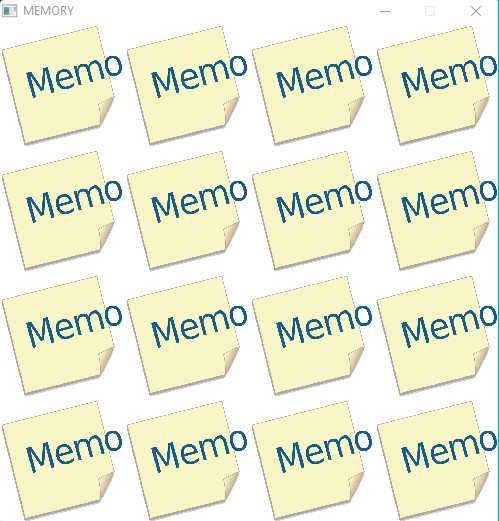
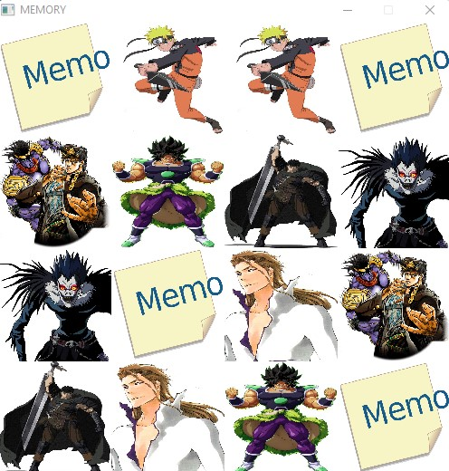

# Game Memory

## Idea

A memory game with graphic display (GraPic) in the world of manga!




There are 18 images chosen randomly, they are stored in /data/memory so you can replace them with those of your choice.

## Subject

To do this project following the instructions of a practical work, I first created a simple memory in text/ascii (the display is on the terminal), the repo of this project is in my [Game_mini_memory.cpp](https://github.com/axelvag/Game_mini_memory)
To then use the GraPic library to make a graphical version.

Here is the subject:
```
Text version

1. Write in C/C++ a procedure asking the player to choose two boxes and
to display the contents of these two boxes by restoring them in the complete grid.

2. Write a user choice verification function in C/C++. If both
chosen boxes are identical the function will return 0 otherwise it will return 1.

3. Simulate the two-player game until all pairs have been found.

GrAPiC version

In order to facilitate the coding of the application in practical work under GrAPiC, we will write here some
subroutines.
In the graphical version, you will use images rather than words in the version
text. The image files will be copied to the Grapic data folder and will be named accordingly.
the following way: Image_Memory_XX.jpg with XX an integer between 01 and 18.
In order to be able to randomly position the images in the game grid, it is imperative to
be able to automatically generate the name of the file which will be associated with the image contained in
Grid. To avoid duplicates (of pairs of cards) it will be necessary to ensure that the chosen index
randomly has not already been selected. For this we will use a table
t_index_image array of MAX_IMAGES boxes of integer type.

1. Write in C/C++ a function which from the table t_index_image chooses
randomly and returns an index not used in this array.

2. Write in C/C++ a procedure which, from an integer passed as a parameter, generates the
name of the associated image file.

3. Write a procedure in C/C++ that positions in the memory grid twice
the image whose name was created previously and marks the index used in the
table t_index_image.
```

# Starting

- Install CodeBlocks (information at the bottom of this page)

- Clone this repo
```bash
$ git clone https://github.com/axelvag/Game_Memory
```

# GrAPiC 

## Starting

Linux, Windows and Mac instruction :

http://licence-info.univ-lyon1.fr/grapic

## Introduction

GrAPiC is a small, easy-to-use framework to add graphical functionalities to your C/C++ code. 
Its main goal is to provide easy graphical functions to be used in introduction courses of algorithm and programming in C/C++. 
It is based on SDL2 but to use it you need to know only few very simples functions. 
The Grapic archive comes with the needed SDL part, you do not have to install SDL. Just unzip and enjoy ! 

## Starting

Compiling from the github (which is not the standard way).

* On Linux you need to install:
- g++
- doxygen
- zip
- lib-sdl2-dev lib-sdl2 sd2_image... sdl2_ttf...

1. sudo apt install g++ premake4 zip doxygen libsdl2-dev libsdl2-mixer-dev libsdl2-image-dev
2. make premake
3. make
(4. script/make_linux_test.sh): to test the archive doc/download/grapic-linux.tgz
(5. script/make_web.sh): to create the zip files in doc/download or to sync everything to the webpage (need passwd).


* On windows
0. Install CB 20
1. run premake-cb20.bat to generate the projects files    or     run premake-lifami.bat to generate lifami projects 
2. open build/windows-cb20/grapic.workspace

## Best way to make a projet in windows

(windows): 
 - Open build/windows-cb20/grapic.workspace in CodeBlocks
 - In the left part (Management) of the logiciel, double clic in the projet of yours choice (it's those in /apps)
 - Finally clic in the green arrow in the top of the screen


## Put your new project in GraPic

Add your directory with your cpp files in "apps" and add the path in "premake4".

